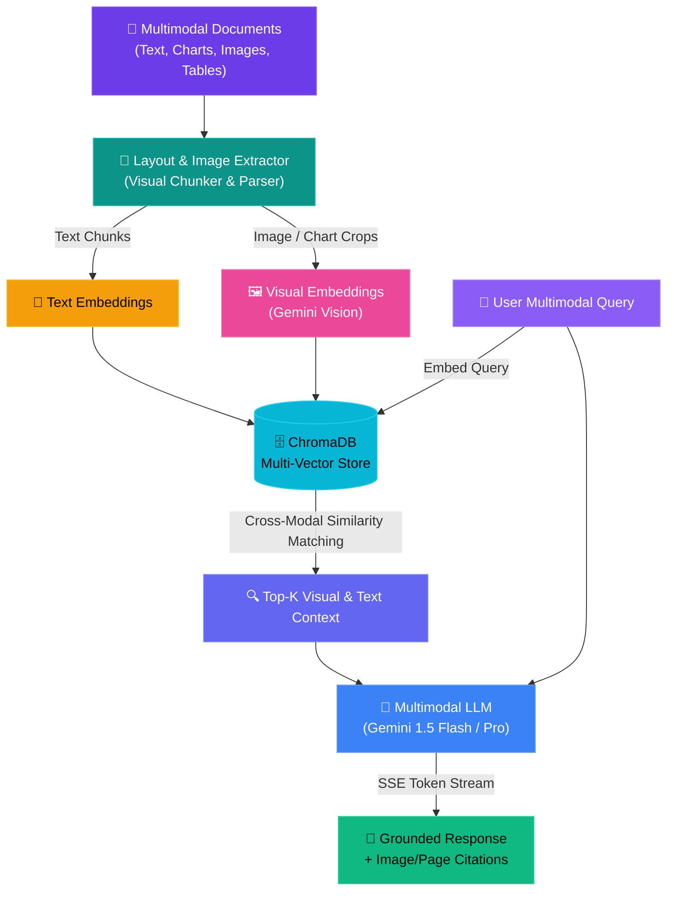
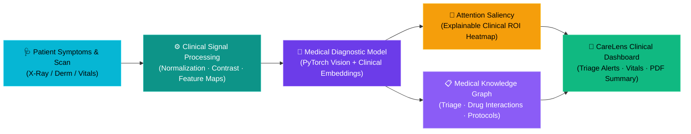
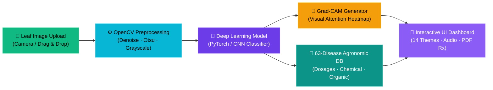
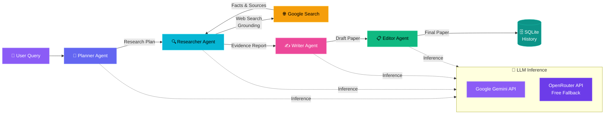

<!-- ═══════════════════════════════════════════════════════════════ -->
<!--      CHIRAG CHAUHAN  ·  AI/ML ENGINEER & PYTHON DEVELOPER     -->
<!-- ═══════════════════════════════════════════════════════════════ -->

<!-- 🌊 Animated Waving Header Banner 🌊 -->

<!-- ⌨️ Typing Animation ⌨️ -->

 

<!-- 📊 Profile Badges 📊 -->

&nbsp;

 

## 👋 About Me

Hi, I'm **Chirag Chauhan** — an AI/ML Engineer and Python Developer. I engineer production-grade intelligent systems bridging **Multimodal RAG pipelines**, **Computer Vision (Healthcare & Agronomy)**, **Large Vision-Language Models (VLMs)**, **Multi-Agent Orchestration**, and **Deep Reinforcement Learning**. My work focuses on building high-throughput, explainable, and resilient AI backends that solve complex real-world challenges.

* 🔮 **Multimodal AI**: Building **Multimodal RAG Systems** combining text, charts, tabular data, and visual embeddings
* 🩺 **Healthcare AI**: Engineering **CareLens** — an intelligent clinical assistance and medical vision platform
* 🌿 **Agronomic Vision**: Developing **PlantGuard AI** — deep learning diagnostics for 63 crop pathologies with Grad-CAM & OpenCV
* 🧠 **Enterprise GenAI**: Production **RAG Chatbots** with FastAPI + ChromaDB + Google Gemini + SSE Streaming
* 🧪 **Research**: **Federated Deep Reinforcement Learning** for dynamic spectrum sensing in cognitive IoT networks
* 🤖 **Agentic Systems**: Autonomous multi-agent pipelines with **LangChain**, **LangGraph**, and Google Search Grounding
* 🎓 **On GitHub since**: **August 2023** — **18+ public repositories** and actively contributing

 

---

## 🛠️ Tech Stack

### 🐍 Languages & Core

  
  
  
  

### 🔮 Multimodal AI, Vision & Deep Learning

  
  
  
  
  
  
  

### 🧠 LLMs, GenAI & Agentic Workflows

  
  
  
  
  
  

### ⚙️ Backend, Frontend & Tooling

  
  
  
  
  
  
  

 

---

## 🚀 Featured Projects

<!-- Project Cards Grid -->
<table border="0" cellpadding="12" cellspacing="0">
  <tr>
    <!-- Multimodal RAG Project -->
    <td width="50%" valign="top">
      <h3 align="center">🔮 Multimodal RAG Intelligence Platform</h3>
      

        
      

      

        
        
        
        
        
      

      <ul>
        <li><strong>Cross-Modal Retrieval</strong>: Ingests and semantically embeds text, charts, diagrams, tables, and images</li>
        <li><strong>Dual-Vector Indexing</strong>: Joint visual & textual embedding search powered by Google Gemini Vision & ChromaDB</li>
        <li><strong>Document Reasoning</strong>: Accurate question-answering over complex PDFs, research papers, and technical slides</li>
        <li><strong>SSE Streaming</strong>: Low-latency streaming response generation with visual grounding & source page citations</li>
      </ul>
    </td>
    <!-- CareLens Project -->
    <td width="50%" valign="top">
      <h3 align="center">🩺 CareLens — AI Clinical & Medical Vision</h3>
      

        
      

      

        
        
        
        
        
      

      <ul>
        <li><strong>Medical Diagnostics Assistant</strong>: Clinical symptom analyzer, vital metrics tracking, and medical image inspection</li>
        <li><strong>Explainable Medical Vision</strong>: Highlights clinical regions of interest on scans with attention saliency</li>
        <li><strong>Prescription & Risk Stratification</strong>: Triage categorization, drug interaction flags, and instant care advice</li>
        <li><strong>Secure Patient History</strong>: End-to-end encrypted session persistence with clinical summary PDF generation</li>
      </ul>
    </td>
  </tr>
  <tr>
    <!-- PlantGuard AI Project -->
    <td width="50%" valign="top">
      <h3 align="center">🌿 PlantGuard AI — Precision Crop Pathology</h3>
      

        
      

      

        
        
        
        
        
      

      <ul>
        <li><strong>Sub-120ms AI Inference</strong>: Diagnoses 63 crop diseases across 9 global agricultural crop families</li>
        <li><strong>Grad-CAM Saliency Maps</strong>: Explainable visual heatmaps highlighting exact foliar lesion triggers</li>
        <li><strong>OpenCV 4-Step Pipeline</strong>: Real-time edge detection, Gaussian denoising, and Otsu lesion segmentation</li>
        <li><strong>63-Disease Botanical Guide</strong>: Description-matched high-res specimen photos with 4-part treatment protocols</li>
        <li><strong>14 Switchable Light UI Themes</strong>: Responsive interface with interactive demo presets and audio feedback</li>
      </ul>
    </td>
    <!-- Enterprise RAG Chatbot -->
    <td width="50%" valign="top">
      <h3 align="center">🧠 Enterprise RAG Chatbot</h3>
      

        
      

      

        
        
        
        
        
      

      <ul>
        <li>Full-stack RAG chatbot eliminating AI hallucinations with verified source citations</li>
        <li>Multi-format document parsing (PDF, DOCX, TXT, Markdown) via pdfplumber and PyPDF2</li>
        <li>Semantic vector search powered by Google Gemini <code>embedding-001</code></li>
        <li>Real-time SSE token streaming for responsive low-latency ChatGPT-like UX</li>
        <li>SQLite session persistence + ChromaDB high-throughput vector store</li>
      </ul>
    </td>
  </tr>
  <tr>
    <!-- Multi-Agent Research Assistant -->
    <td width="50%" valign="top">
      <h3 align="center">🧪 Multi-Agent Research Assistant</h3>
      

        
      

      

        
        
        
        
        
      

      <ul>
        <li>4 autonomous agents: <strong>Planner → Researcher → Writer → Editor</strong></li>
        <li>Real-time Google Search Grounding to anchor factual generation</li>
        <li>Self-healing API gateway with HTTP 402 auto-rerouting across model providers</li>
        <li>JWT authentication + Bcrypt hashing + SQLite history management</li>
      </ul>
    </td>
    <!-- F-DRL Research Project -->
    <td width="50%" valign="top">
      <h3 align="center">📡 Federated DRL for Spectrum Sensing</h3>
      

        
      

      

        
        
        
        
      

      <ul>
        <li><strong>BiLSTM Spectrum Sensor</strong>: Conv1D + Multi-Head Attention for 24 modulation types</li>
        <li><strong>Dueling DQN Agents</strong>: Prioritized experience replay for channel selection</li>
        <li><strong>Hierarchical FedAvg</strong>: Non-IID Dirichlet distribution across edge/clients</li>
        <li><strong>Multi-Agent DRL</strong>: Dynamic collision avoidance in cognitive IoT networks</li>
      </ul>
    </td>
  </tr>
</table>

 

---

## 🏗️ System Architectures

### 🔮 Multimodal RAG Pipeline

### 🩺 CareLens Clinical Diagnostics & Medical Vision Pipeline

### 🌿 PlantGuard AI Computer Vision Diagnostic Pipeline

### 🧠 Multi-Agent Orchestration Pipeline

 

---

## 📊 GitHub Stats & Metrics

  
  &nbsp;&nbsp;
  

 

  

 
 

<!-- 🌊 Footer Wave 🌊 -->

  
🔮 Made with ❤️ by <a href="https://github.com/C-2631">Chirag Chauhan</a> · 💼 2026 Profile

