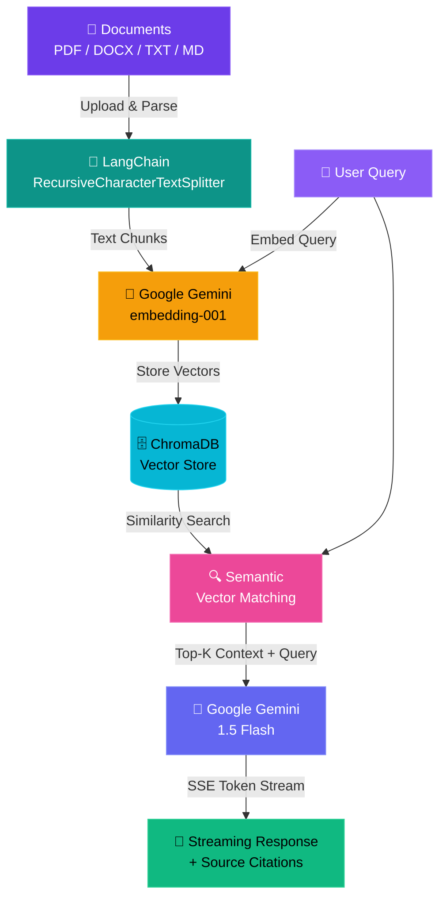
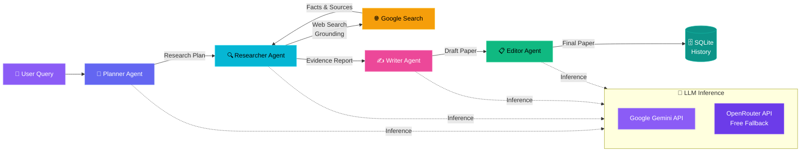

<!-- ═══════════════════════════════════════════════════════════════ -->
<!--      CHIRAG CHAUHAN  ·  AI/ML ENGINEER & PYTHON DEVELOPER     -->
<!-- ═══════════════════════════════════════════════════════════════ -->

<!-- 🌊 Animated Waving Header Banner 🌊 -->

<!-- ⌨️ Typing Animation ⌨️ -->

 

<!-- 📊 Profile Badges 📊 -->

&nbsp;

 

## 👋 About Me

Hi, I'm **Chirag Chauhan** — an AI/ML Engineer and Python Developer. I build intelligent backend systems that combine **Large Language Models**, **RAG pipelines**, **multi-agent orchestration**, and **deep reinforcement learning**. My work spans from training federated DRL models for IoT spectrum sensing to building production-ready enterprise chatbots with document processing.

* 🔭 **Currently building**: An **Enterprise RAG Chatbot** with FastAPI + ChromaDB + Google Gemini
* 🧪 **Researching**: **Federated Deep Reinforcement Learning** for spectrum sensing in cognitive IoT networks
* 🤖 **Working with**: **Multi-Agent Systems**, **LangChain**, **LangGraph**, and **Vector Embeddings**
* ⚡ **Experienced in**: **Async backends** with FastAPI, SSE streaming, and aiosqlite
* 📄 **Automating**: Document processing with **PyPDF2**, **pdfplumber**, and **python-docx**
* 🎓 **On GitHub since**: **August 2023** — **15 public repositories** and growing

 

---

## 🛠️ Tech Stack

### 🐍 Languages

  
  

### 🧠 AI & GenAI

  
  
  
  
  
  

### 📦 Frameworks & Libraries

  
  
  
  
  
  
  
  
  
  

### 🔌 LLM Platforms

  
  
  

### ⚙️ Backend & Databases

  
  
  
  
  
  
  

### 🔧 Tools

  
  
  
  
  

 

---

## 🚀 Featured Projects

<!-- Project Cards Grid -->
<table border="0" cellpadding="12" cellspacing="0">
  <tr>
    <!-- Enterprise RAG Chatbot -->
    <td width="50%" valign="top">
      <h3 align="center">🧠 Enterprise RAG Chatbot</h3>
      

        
      

      

        
        
        
        
        
      

      <ul>
        <li>Full-stack RAG chatbot eliminating AI hallucinations with source citations</li>
        <li>Multi-format document support (PDF, DOCX, TXT, Markdown)</li>
        <li>Semantic vector search using Google Gemini <code>embedding-001</code></li>
        <li>Real-time SSE token streaming for ChatGPT-like experience</li>
        <li>SQLite session persistence + ChromaDB vector storage</li>
      </ul>
    </td>
    <!-- Multi-Agent Research Assistant -->
    <td width="50%" valign="top">
      <h3 align="center">🧪 Multi-Agent Research Assistant</h3>
      

        
      

      

        
        
        
        
        
        
      

      <ul>
        <li>4 specialized agents: Planner → Researcher → Writer → Editor</li>
        <li>Real-time Google Search Grounding to eliminate hallucinations</li>
        <li>Self-healing API gateway with HTTP 402 auto-rerouting to free models</li>
        <li>JWT authentication + Bcrypt password hashing + SQLite history</li>
      </ul>
    </td>
  </tr>
  <tr>
    <!-- F-DRL Research Project -->
    <td colspan="2" valign="top">
      <h3 align="center">📡 Federated Deep Reinforcement Learning for Spectrum Sensing</h3>
      

        
      

      

        
        
        
        
        
      

      
<em>6-month deep research project</em>

      <ul>
        <li><strong>BiLSTM Spectrum Sensor</strong>: Conv1D feature extraction + multi-head attention for modulation classification across 24 modulation types</li>
        <li><strong>Dueling DQN Agents</strong>: Deep Q-Network with dueling architecture and prioritized experience replay for intelligent channel selection</li>
        <li><strong>Federated Learning</strong>: Hierarchical aggregation (Central → Edge → Clients) using FedAvg with Dirichlet non-IID data partitioning</li>
        <li><strong>Multi-Agent DRL</strong>: Collision avoidance in dynamic spectrum access across cognitive IoT devices</li>
        <li><strong>GPU/CPU Hybrid</strong>: Automatic CUDA support with memory optimization for training efficiency</li>
      </ul>
    </td>
  </tr>
</table>

 

---

## 🏗️ System Architectures

### Enterprise RAG Pipeline

### Multi-Agent Orchestration Pipeline

 

---

## 📊 GitHub Stats & Metrics

  
  &nbsp;&nbsp;
  

 

  

 
 

<!-- 🌊 Footer Wave 🌊 -->

  
🔮 Made with ❤️ by <a href="https://github.com/C-2631">Chirag Chauhan</a> · 💼 2026 Profile

